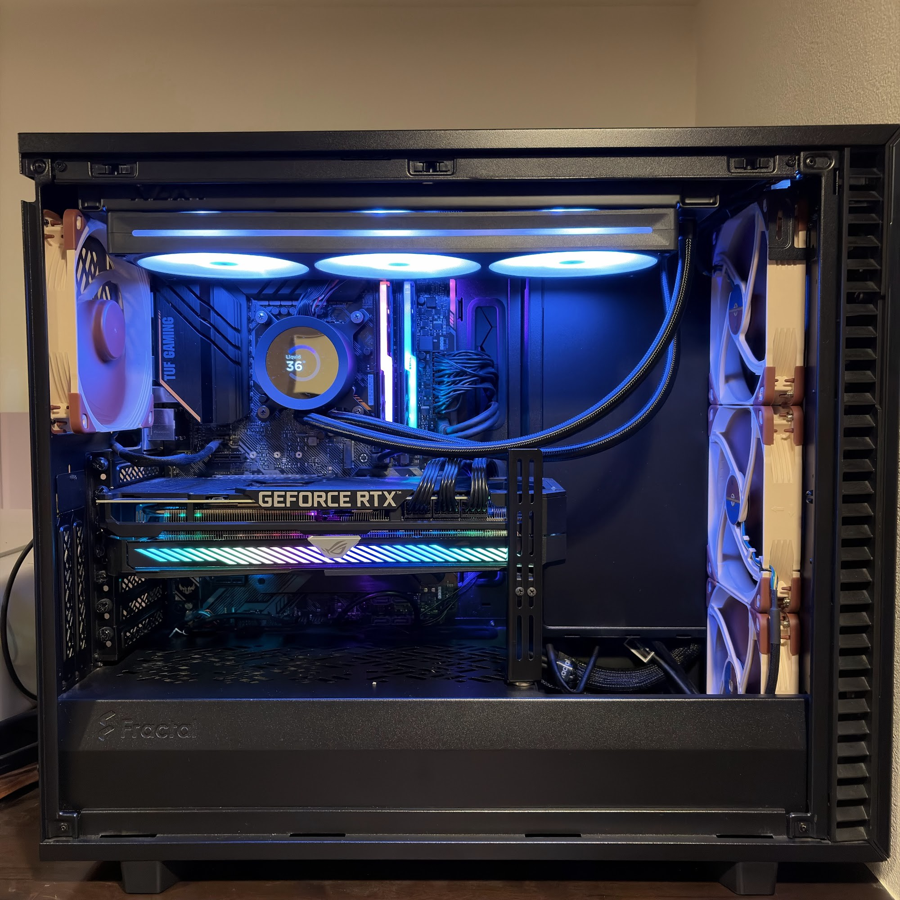

# PC System Lab

自作PCの構成と、冷却、GPU、CPUを調整してきた過程を記録しています。設定値だけでなく、何が気になり、どの条件で測り、結果をどう判断したのかも残しています。

[現在使っているPCの構成と調整方針](docs/current-pc.md)

## いま取り組んでいること

CPUの倍率と電圧の調整は一区切りにしました。並行してRTX 3080を750 mVまで下げ、DLSS常時適用とPreset K指定で普段のゲームの見え方も確認しました。その設定で約8時間20分のFF14を回し、締めの長時間試験まで終えています。

- 最新の記事：[ケースの冷却を確かめてから、UVとファンの下限を詰める](articles/system-tuning-cooling-after-undervolt.md)
- GPUの調整：[RTX 3080を750 mVまで下げて、普段のゲームで確かめる](articles/system-tuning-gpu-750mv-dlss.md)
- CPU検証の締めくくり：[ブラウザの測り方を揃え直して、CPU調整を一区切りにする](articles/system-tuning-cpu-validation-complete.md)
- 今回の調整を最初から：[ファンを静かにしたあと、CPU電圧をもう一度詰める](articles/system-tuning-2026-09-05-ffxiv-voltage.md)

## 自作PCチューニング記録

AIOの故障をきっかけに、冷却からGPU、CPUへと調整が広がっていった経緯を書いています。[連載の索引](articles/system-tuning-2026-09-01-index.md)に各記事のあらすじと読む順番をまとめています。

[記事一覧](articles/README.md)から各記事を直接読めます。

この公開版には、個人情報や端末固有情報を含み得るEvent Log、Raw Data、ソフトウェア一覧、運用設定、完全な会話ログを含めていません。記事中の数値は、非公開の記録用リポジトリに保存した測定結果をもとにしています。

## ライセンス

このリポジトリで公開する独自の文章と写真は、特記がない限り[Creative Commons Attribution 4.0 International](LICENSE.md)（CC BY 4.0）で利用できます。再利用するときは`Kenn-dclxvi`を作者として示し、このリポジトリとライセンスへのリンクを残してください。変更した場合は、そのことも示してください。

FFXIVベンチマーク画面など、第三者に権利がある画像はCC BY 4.0の対象外です。該当画像は掲載ページの権利表記と[ファイナルファンタジーXIV 著作物利用条件](https://support.jp.square-enix.com/rule.php?id=5381&tag=authc)に従って扱ってください。

今後は、公開できる試験結果を記事として追加し、PC全体の写真も撮れたら内部写真と分けて載せたいと思います。
