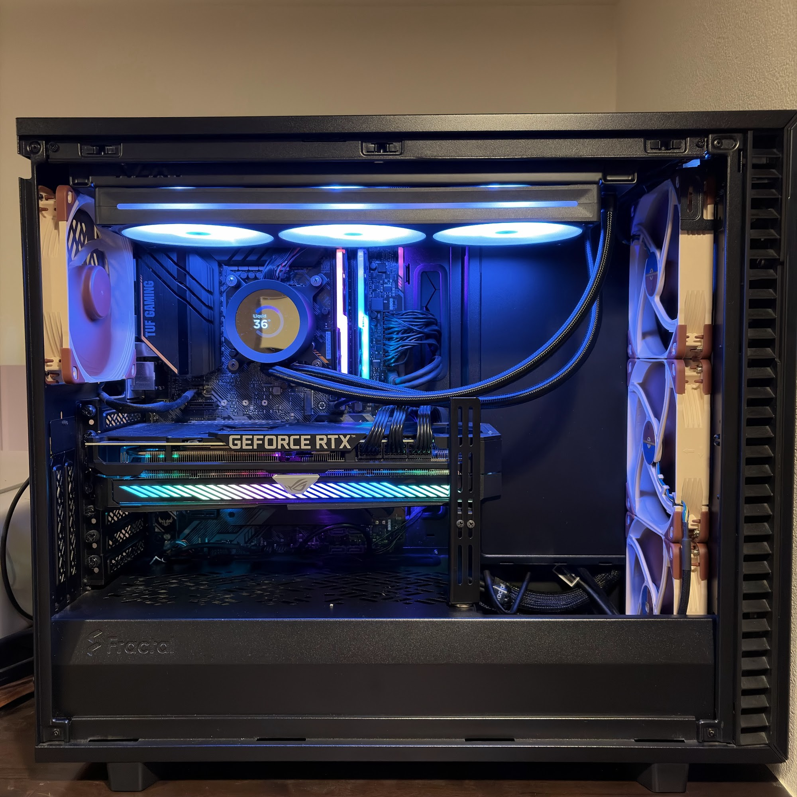

# PC System Lab

自作PCの構成と、冷却、GPU、CPUを調整してきた過程をまとめています。設定値だけを並べるのではなく、何が気になり、どの条件で測り、結果をどう判断したのかを残すための公開版です。

## まず読む

| 知りたいこと | 読むもの |
| --- | --- |
| PCの構成と調整方針 | [現在使っているPC](docs/current-pc.md) |
| 冷却からCPU調整までの流れ | [2026年 自作PCチューニング記録](articles/system-tuning-2026-09-01-index.md) |
| 公開している記事の一覧 | [記事一覧](articles/README.md) |

この公開版には、個人情報や端末固有情報を含み得るEvent Log、Raw Data、ソフトウェア一覧、運用設定、完全な会話ログを含めていません。記事中の数値は、非公開の記録用リポジトリに保存した測定結果をもとにしています。

## ライセンス

このリポジトリで公開する独自の文章と写真は、特記がない限り[Creative Commons Attribution 4.0 International](LICENSE.md)（CC BY 4.0）で利用できます。再利用するときは`Kenn-dclxvi`を作者として示し、このリポジトリとライセンスへのリンクを残してください。変更した場合は、そのことも示してください。

今後は、公開できる試験結果を記事として追加し、PC全体の写真も撮れたら内部写真と分けて載せたいと思います。
