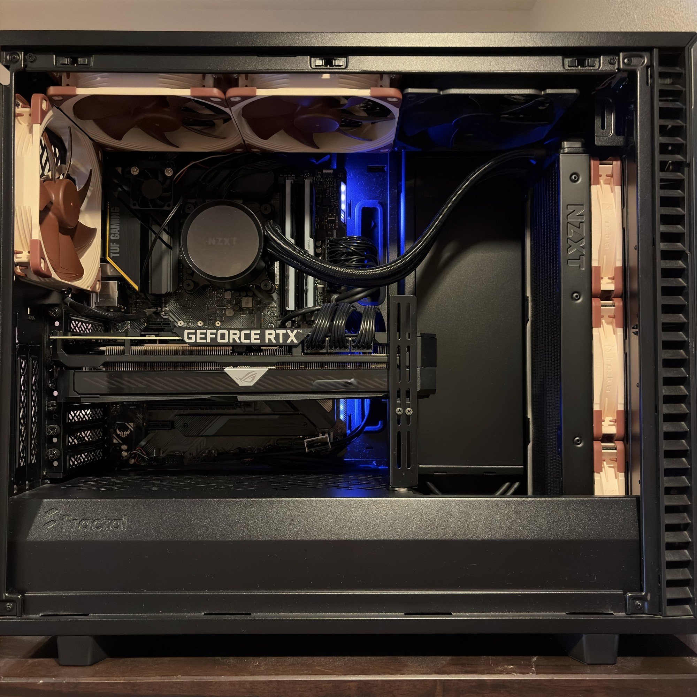

# AIO故障から、必要な分だけ回す冷却へ

[← 索引](./system-tuning-2026-09-01-index.md) / [次: GPU編 →](./system-tuning-2026-09-01-gpu.md)

この一連のチューニングは、AIOが故障したところから始まりました。

最初はAIOを直して、ついでにケースファンを整理するくらいのつもりでした。

## 交換は、AIOだけでなく空気の流れも変えた

*交換前の構成。Kraken X73の360 mmラジエーターを前面吸気で使っていました。*

交換前は、前面から入った外気がKraken X73のラジエーターを通り、CPUの熱を受け取ってからケース内へ入る構成でした。CPUは外気で直接冷やせます。ただ、その後ろにあるRTX 3080、マザーボード、メモリへ届くのは、ラジエーターを通過したあとの空気です。

で、AIO交換時には旧X73を前面から外し、天面にあったNoctua 140 mmファン3基を前面へ移しました。新しいKraken 360は天面排気にしています。前面はラジエーターを通さない直接吸気になり、CPUの熱は冷却水から天面ラジエーターを通ってケース外へ出るようになりました。

*交換後の構成。前面はNoctua 140 mmファン3基の直接吸気、新しいKraken 360は天面排気です。*

もちろん、良いことだけではありません。天面排気のラジエーターは、GPUなどで温まったケース内の空気を使ってCPUを冷やします。交換時のやり取りでも、CPU冷却には不利になる可能性がある一方で、前面を開放してRTX 3080へ外気を届けやすくし、CPUの熱をケース内へ入れない方を選びました。

最初はラジエーターを天面の中央へ取り付けたため、ラジエーターファンとメモリの隙間が約1 mmしかありませんでした。Define 7の天面ブラケットには、こうした干渉を避けるためラジエーターを左側へずらせるオフセット機構があります。ただ、その意味に気づかず、感覚的に中央へ付けていました。ケース側はちゃんと考えていたのに、こちらのラジエーター取り付け経験が足りていませんでしたね。で、左側へオフセットし、メモリとの間に十分な隙間を確保しました。

交換直後にCPU温度は大きく下がりましたが、これは故障していたX73を交換した影響が大きく、エアフロー変更だけの効果とは分けられません。ただ、今回の作業がAIOの置き換えだけではなく、ケースに熱を入れる場所と外へ出す場所を変えた構成変更だったことは、この写真と当時の検討から確認できます。

ただ、せっかく冷却系を触るなら、今のケース内で何がどれくらい効いているのかを一度ちゃんと見ておきたい。そこで、設定画面だけを見るのではなく、実際の温度と回転数を取るところから始めました。

CPU温度、CPU Package Power、GPU温度、Hotspot、Memory Junction、Rear / Front / Bottom fan、Kraken pump、Kraken Liquid。取れるものは同じ時間軸で記録します。

Kraken radiator fanのRPMのように取得できない値もありました。そこは推測で埋めず、Missing Dataのまま残します。

この時点ではまだ、ここからCPUのBIOSまで掘ることになるとは思っていませんでした。

## 最初にBottomファンで「設定したつもり」を食らう

まずBottomファンをGPU温度連動へ変更しました。

ところが実際のRPMを見ると、GPUが50℃以下でも75℃以上でも約900 RPMのままでした。

設定画面ではGPU連動になっています。でも実機は温度へ追従していない。

Bottomファンは3ピンなので、PWMではなくDC Modeで制御する必要がありました。Fan Xpertで較正し、最低Dutyや停止域を取り直すと、ようやく期待した動きになります。

さらに、保存したファンプロファイルと、再起動後にASUS fan serviceが実際に使っていた`FanStore.xml`が一致しない試験もありました。

ベンチ自体は通っています。

でも、試したかった設定で動いていないなら、その試験を評価に使ってはいけない。

ということで、ここからは「設定した値」より「実際に制御側が使っている値」を優先して確認するようにしました。

この照合はAIエージェントにかなり任せました。`FanStore.xml`の内容、設定した温度ソースやカーブ、実際のRPMを見比べ、条件が違えばその試験を採用しない。人間だけでもできる確認ですが、設定を変えるたびに毎回やるのは手間です。今回はそこを普通の確認手順として続けられました。

## 全部のファンをGPU連動にしたら、ちゃんと動いた。でもうるさい

次はRear、Front、Bottomを全部GPU Temperature連動へ変更しました。

今度は狙ったとおり動き、FF14も完走しました。WHEAや計測データの問題もありません。

ただ、高負荷になるとRearとFrontがかなり高い回転数まで上がります。

で、うるさい。

ここで、全部のファンを同じ温度へつなぐことと、全部を同じ勢いで回すことは別だと考えました。

Rearはケース全体の排気。FrontはGPUへ空気を入れる吸気。Bottomは局所的な補助吸気です。

役割が違うなら、必要な風量も違うはずです。

そこでRearとFrontを少しずつ下げました。

最初に平均で約80～95 RPM落としても、温度や性能に明確な悪化はありませんでした。体感騒音にも大きな差はありません。

なら、もう一段下げられるかもしれない。

そうやって段階的に落として、最終的にRearはCPUとGPUの高い方を見て`40℃ 31% / 60℃ 40% / 80℃ 59%`、FrontはGPUを見て`40℃ 40% / 60℃ 40% / 80℃ 60%`へ落ち着きました。

80℃より上には100%の安全点を残しています。

普段100%で回したいわけではありません。異常時に使える上限だけは残す、という考えです。

## Rearを100%にして、上限側も測ってみる

ここで一度、Rearを100%固定にしてみました。

普通に考えると、排気を増やせばもう少し冷えてもよさそうです。

Rearの平均回転数は約779 RPMから約1,480 RPMへ上がりました。約700 RPM増えています。

ところがGPU平均温度は0.20℃高く、Hotspotも0.32℃高い結果でした。

もちろん、この小さな差から「100%にすると温度が上がる」とは言えません。試験ごとの差の範囲かもしれません。

ただ、約700 RPM増やしても明確な冷却改善がないことは分かります。

通常設定でも、ケース内はもう十分に排熱できているのかなと思いました。

そこから先は風量を増やしても、得られるものより騒音の方が大きい。

ということでRear 100%固定は不採用にしました。

この「一度上限を測ってから必要なところまで戻す」という考え方は、後でCPUの電圧調整でもそのまま使うことになります。

## Bottomは止めてもほとんど変わらなかった

導風板を入れたあと、Bottomファンの低回転と停止も比較しました。

停止時の差は、GPU平均で+0.01℃、Hotspot平均で+0.15℃でした。

ほとんど同じです。

Frontから入った空気がGPUへ流れる経路ができていれば、Bottomから追加で押し込む空気の寄与はかなり小さいのかもしれません。

だったら止めた方が、騒音、埃、消費電力を少しずつ減らせます。

Bottomは停止することにしました。

その後の長時間FF14もBottom停止状態で完走しているので、少なくとも現在の構成では止めたことが大きな問題にはなっていません。

## KrakenはCPU温度ではなくLiquidを見る

CPU温度は短時間でかなり上下します。

そこへpumpやradiator fanを直接追従させると、CPUの瞬間的な負荷変化に合わせて回転数まで頻繁に変わります。

一方、KrakenのLiquid温度はもっとゆっくり変化します。

ケース全体から冷却系へ入っている熱量を見るなら、こっちの方が扱いやすい。

PumpはNZXT CAMのSilentを使用し、Liquid温度連動にしました。

Radiator fanもLiquidを見るようにしています。

途中ではradiatorを100%固定にしたり、より高い回転数を使うカーブも試しました。

ただ、回転数を増やした分だけ明確に冷えるわけではありませんでした。

ここもRearと同じです。

必要な排熱能力へ達したあとでは、さらに回しても効果が飽和するようです。

## 瞬間温度ではなく、熱平衡まで見る

長時間試験を始めてから、冷却の見方も変わりました。

CPUやGPUの最大温度だけではなく、Liquidがどこまで上がり、そこからさらに上がり続けるのかを見るようになりました。

最終的な長時間試験ではLiquidが45℃まで上がり、最後の30分を平均45℃で維持しました。

CPU thermal throttlingとpower limitは0です。

つまり冷却水が温まりきったあとも、システムがその温度で釣り合っている。

短いベンチで「最大温度○℃だった」より、この方が常用状態を判断する材料としては強いと思います。

## ケース冷却で結局やったこと

最初は、ファンを強く回せば冷えると思っていました。

実際には、Rearを約700 RPM増やしてもほとんど変わらない。Bottomは止めても変わらない。radiator fanも一定以上は回しても効果が小さい。

そこで、最大回転を狙うのをやめました。

それぞれのファンが何のためにあるのかを分け、必要な熱を運べるところまで回す。

そして異常時の100%だけは残す。

最終的には、**強く回すところから、必要な分だけ回すところへ**考え方が変わりました。

で、ケース側をかなり整理できると、次に目立ってきたのがRTX 3080の発熱です。

ケースファンをさらに数十RPM詰めるより、GPUからケースへ入る熱そのものを減らした方が効きそうです。

ということで、次はGPUのV/F Curveを触ることにしました。

[← 索引](./system-tuning-2026-09-01-index.md) / [次: GPU編 →](./system-tuning-2026-09-01-gpu.md)
