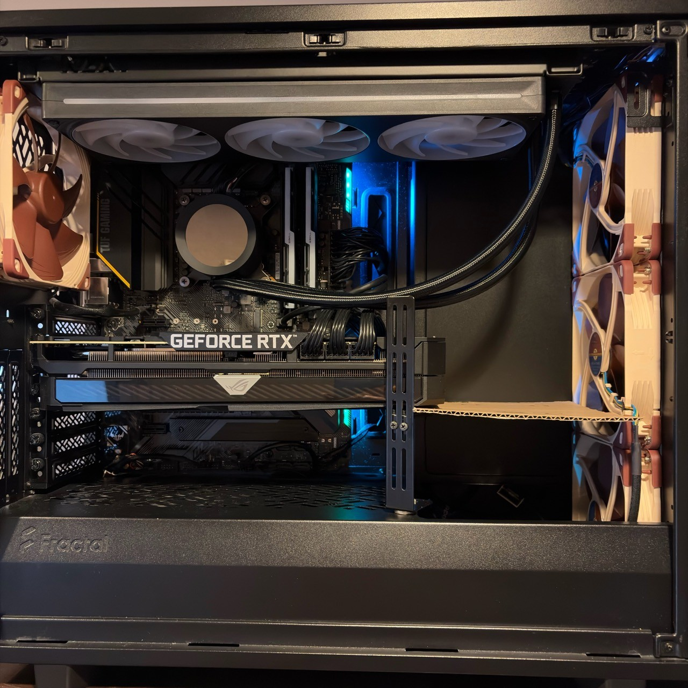
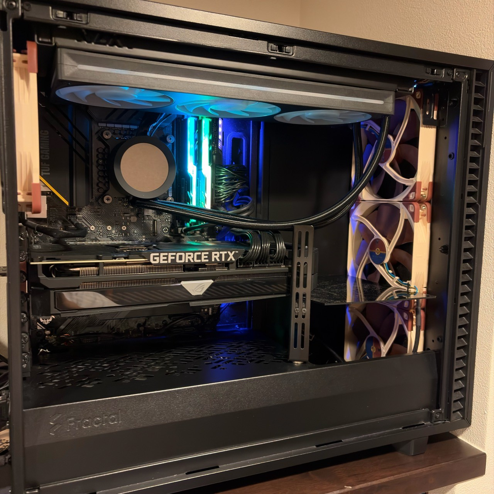
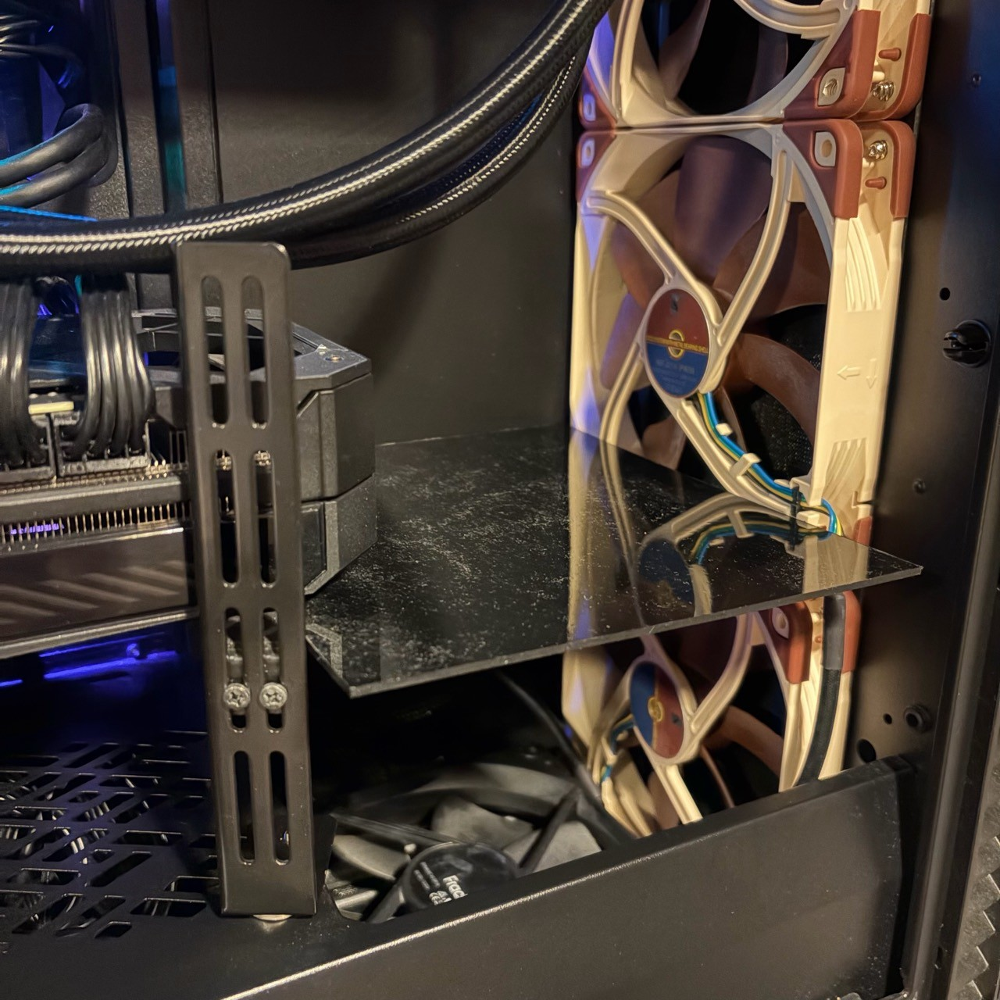

# GPUの前に導風板を入れてみる

[自作PCチューニング記録](./system-tuning-2026-09-01-index.md) / [ケース・冷却編](./system-tuning-2026-09-01-case-cooling.md)

ケースの冷却を見直していたときに、前面から入った風をもう少しGPUの下へ向けられないかと考えていました。

使っているDefine 7は、前面に140 mmファンが3基、底面にも吸気ファンが1基あります。底面へもう1基追加する案も出ましたが、その場所には電源があるので入りません。それなら、前面ファンとGPUの間に仕切りを入れてみるのがよさそうです。

## GPUと前面ファンの間を仕切る

仕切りの位置をAIと相談している途中では、GPU下面の認識が合わず、GPUの上側へ風を送るような図が出てきました。冷やしたいのは、GPUと電源カバーの間にあるファンの吸気側です。

自分が考えていたのは、GPUの先端から前面ファンまで水平に板を渡す形でした。底面から入った空気がそのまま上へ抜けず、GPUのファンがある方へ向かうことを期待しました。前面の下段ファンから入る風も、その下の空間へ流れるだろうと考えました。

まずは段ボールを使って、実際に置いてみました。

*段ボールで作った試作。GPUの下側を塞がず、先端から前面ファンまでの空間を水平に仕切っています。*

写真では右側がケース前面です。板の下に前面最下段と底面のファンがあり、左側はGPUの下へつながっています。GPU全体を囲うような加工はせず、この一枚を入れて温度を測ってみます。

## 付けて、外して、もう一度付ける

測定にはFF14「黄金のレガシー」ベンチマーク Ver.1.1を使いました。3840×2160のカスタム設定で、DLSSの動的解像度は常時適用です。GPUの低電圧化を始める前なので、このときのRTX 3080は負荷中に平均約340～350 W使っています。

段ボールを付けた状態で測り、次に外して測り、最後にもう一度付けて測りました。表はGPU使用率50%以上の区間の平均です。

| 導風板の状態 | GPU温度 | Hotspot | GPUファン1 |
| --- | ---: | ---: | ---: |
| あり | 67.42℃ | 82.74℃ | 1,843 RPM |
| 外す | 67.67℃ | 83.30℃ | 1,877 RPM |
| もう一度付ける | 67.48℃ | 82.47℃ | 1,863 RPM |

外したときに少し高くなり、戻すと下がりました。板を付けた2回を合わせると、なしに対してGPUは約0.2℃、Hotspotは約0.7℃低く、GPUファンも約24 RPM低くなっています。

差は小さいですが、板一枚で少しでも改善するなら残しておきたいと思いました。作り直すためのプラ板を注文しました。

## 底面ファンを強くしても変わらない

下からの風をGPUへ向けるつもりで作ったので、底面ファンを強くしたときの変化も気になります。

通常の約590 RPMから850 RPM程度まで上げ、一度元へ戻してから、約890 RPMまで上げてみました。ところが、回転数を上げてもGPU温度はほとんど下がりません。さらに、板を入れたまま底面ファンを止めても測りました。

| 底面ファンの状態 | 実際の回転数 | GPU温度 | Hotspot |
| --- | ---: | ---: | ---: |
| 通常設定へ戻す | 589 RPM | 66.68℃ | 82.37℃ |
| さらに増速 | 893 RPM | 66.99℃ | 82.22℃ |
| 停止 | 停止 | 66.69℃ | 82.52℃ |

回転数を約1.5倍にしても、止めても、温度はほぼ同じでした。もう少し変化が出るかと思っていたのですが、前面ファンから入る風の方が効いているのかもしれません。

停止した回にはCPU/cache系のWHEAも1件出ています。その後の長時間試験と、底面ファンの停止を採用するまでの経緯は[ケース・冷却編](./system-tuning-2026-09-01-case-cooling.md#bottomは止めてもほとんど変わらなかった)に書いています。

続けて、底面ファンを止めたままサイドパネルを開けてみました。GPUの平均温度は66.69℃から66.30℃、Hotspotも82.52℃から82.18℃で、これもほとんど変わりません。

背面ファンを強くしたり、天面のラジエーターファンを100%にしたりしても、GPU温度には目立った改善がありませんでした。ここまで試すと、ケースの風量を増やす余地より、GPU自身のクーラーやファンの方が気になります。

## プラ板に作り直す

その後、段ボールをプラ板へ置き換えました。

*作り直した導風板。GPUの先端から前面ファンまで、黒い板を渡しています。*

*斜め上から見たところ。板の下には前面下段のファンと底面ファンが見えます。*

出来上がったものを見ていると、上側の暖かい空気がGPUの下へ入りにくくなる方が、この板の働きとしては大きいのではないかと思えてきました。

最初は底面から吸った風をGPUへ向けたくて入れた板でしたが、その底面ファンを止めてもGPU温度は変わりませんでした。サイドパネルを開けた結果からも、GPUを冷やすうえではGPU自身のファンが大きいと感じています。それでも板の有無では小さな差が出ていたので、上下の空気の混ざり方が気になります。

今度は板の上と下で、空気の温度がどれくらい違うのかを測ってみたくなりました。
