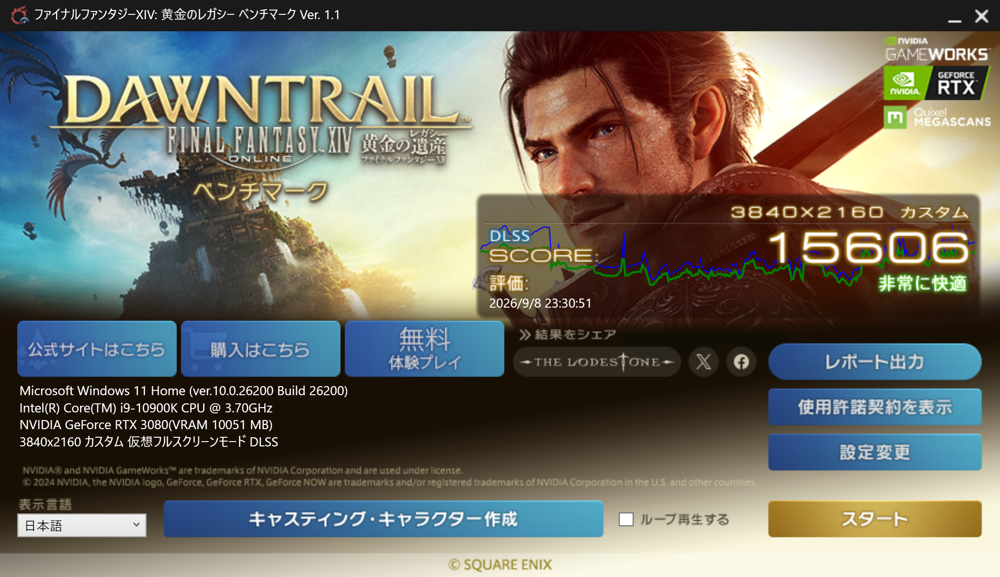

# RTX 3080を750 mVまで下げて、普段のゲームで確かめる

[← CPU検証の締めくくり](./system-tuning-cpu-validation-complete.md) / [索引](./system-tuning-2026-09-01-index.md)

CPUの倍率を試している間に、GPUの電圧ももう少し下げてみたくなりました。

前の長時間FF14では、CPUの平均電力が約36 Wになった一方、GPUは約274 W使っていました。RTX 3080はすでに850 mVで動かしていましたが、ここから800 mVくらいまで下げたら、どのくらい変わるのでしょうか。

ただ、電力を下げるためにゲームの動きが悪くなるのは困ります。クロックを下げるとしても、実際に遊ぶときに気にならない範囲にしたいと考えていました。

## 5年前にも800 mVを試していた

800 mVで使うクロックを相談していると、1830 MHzで動かした昔の記録が残っていることを思い出しました。5年前の「漆黒のヴィランズ」ベンチマークの結果です。

今の「黄金のレガシー」で試すと、800 mVの高クロック側はDirectXエラーになりました。昔の結果を見つけたものの、今回はクロックを下げる必要がありました。

1740 MHz／800 mVにしたところ、単発ベンチは完走しました。4K最高品質、DLSSは60 fps未満で適用する設定です。

直前の850 mVの単発記録と比べると、スコアは10,863から10,680へ約1.7%下がり、GPU平均電力は277.27 Wから235.71 Wへ下がりました。スコアの差は小さいのに、電力は約42 Wも減っています。

## 実際のクロックを見直す

設定クロックを下げた割にスコアが変わらなかったので、AIとの相談では、850 mV側が高いクロックを維持できていなかったのではないかという話が出ました。

そこで、設定値に加えて実測クロックも見直してもらいました。

850 mV側は平均1918.79 MHzで、62点中57点が1920 MHzでした。最小でも1905 MHzあり、クロックが落ちたまま動いていた様子はありません。

800 mV設定側は平均1762.86 MHzで、実測電圧は793.75 mVでした。実際にもクロックは約8%下がっています。それでも平均FPSの低下は約3%に留まっていました。

850 mV側がクロックを維持できていなかった、という説明は違ったようです。動的解像度も有効な測定なので、なぜクロックの差ほどFPSが変わらなかったのかは、まだ分かりませんでした。

## 200 Wくらいまで下げてみたい

約236 Wでこれだけ動くなら、200 Wくらいではどのくらいのスコアが出るのか気になってきました。

次は750 mVです。GPU Tweakのカーブを1620 MHzに設定して測りました。実測はほぼ1650 MHzで、スコア10,611、GPU平均電力207.68 Wでした。

ここまでの単発結果を並べると、こうなります。表のクロックと電圧は設定値で、描画設定はいずれも4K最高品質・DLSSは60 fps未満で適用です。

| GPU設定 | スコア | 平均FPS | 最低FPS | GPU平均電力 |
| --- | ---: | ---: | ---: | ---: |
| 1905 MHz／850 mV | 10,863 | 75.44 | 50 | 277.27 W |
| 1740 MHz／800 mV | 10,680 | 73.44 | 51 | 235.71 W |
| 1620 MHz／750 mV | 10,611 | 72.47 | 51 | 207.68 W |

850 mVの記録から電力は約25%下がり、スコアは約2%低くなっただけです。750 mVの回はWHEAやGPUドライバーの障害もなく、温度制限フラグも出ませんでした。800 mVで出ていた2点の温度制限フラグも、この回にはありません。

数字を見て効率のよさには驚きました。ただ、画面を見ていると少しカクつきを感じました。スコアや最低FPSがほぼ同じでも、見たときに気になるところはあります。

## DLSSを常に適用してみる

次は750 mVのまま、DLSSを常に適用する設定へ変えて測りました。

| DLSSの適用条件 | 60 fps未満 | 常に適用 |
| --- | ---: | ---: |
| スコア | 10,611 | 15,548 |
| 平均FPS | 72.47 | 107.82 |
| 最低FPS | 51 | 68 |
| GPU平均電力 | 207.68 W | 193.48 W |
| CPU平均電力 | 35.96 W | 41.70 W |

平均は100 fpsを超え、最低も68 fpsになりました。GPUのクロックはほぼ同じなのに、GPU平均電力はさらに下がっています。CPUの方は、今度は少し電力が増えました。

まだ違和感は残りますが、このくらいなら使えそうにも感じました。ただ、クロックを下げたことを意識して細かく見ているから、余計に気づいているのかもしれません。1905 MHzへ戻しても同じところが気になるのではないかと思い、戻して見比べてみました。

気になる場面と、気にならない場面がありました。そこで実際のゲームも見てきたのですが、こちらでは違いが分かりません。普通に滑らかに動いていました。

ベンチでは200 W弱まで下がり、普段のゲームも滑らかに動いています。DLSSの見え方も気にならないなら、RTX 3080を買い替える理由はまた一つ減ったように感じます。

## NVIDIA Appの設定も変えてみる

その後、NVIDIA AppでDLSSのPreset Kを指定し、垂直同期も「高速」へ変更しました。

同じ1620 MHz／750 mV、4K・DLSS常時適用で、もう一度ベンチを回しました。

| 単発結果 | 前回 | Preset K指定後 |
| --- | ---: | ---: |
| スコア | 15,548 | 15,606 |
| 平均FPS | 107.82 | 108.04 |
| 最低FPS | 68 | 65 |
| GPU平均電力 | 193.48 W | 195.88 W |

© SQUARE ENIX

性能も平均電力もほぼ同じで、前に気になっていたボケやにじみはほぼなくなりました。実測クロックは今回は1620～1635 MHzで、平均1628 MHzです。電圧は750 mVのままでした。

普段のゲームは基本的に60 fpsで遊んでいます。新生FF14も、60 fpsで安定して動くことを前提に開発が始まったゲームです。[フレームレートについての公式説明](https://jp.finalfantasyxiv.com/lodestone/news/detail/057d83c566b5c3894deb7d4a0a723634b45866b1)。過去には、60 fpsから上限なしへ変えると布の裾や耳飾りの揺れが小さくなるという報告も、公式フォーラムに上がっていました。[揺れの表現に関する不具合報告](https://forum.square-enix.com/ffxiv/threads/234173)。

キャラクターの細かな動きまで楽しみたいので、FF14では開発の基準になった60 fpsに合わせています。今回の設定なら、普段遊ぶには十分です。メインで遊んでいるFF11は30 fpsで、GPUにはさらに余裕があります。

このPCの構成を考えた5年前は、FF14の第1次グラフィックスアップデートより前でした。今の「黄金のレガシー」ではキャラクターや背景の質感、テクスチャや影の表現が大きく変わり、増えた処理負荷に合わせて必要な動作環境も引き上げられています。[黄金のレガシーベンチマークの公式説明](https://jp.finalfantasyxiv.com/benchmark/index.html)。

5年前に選んだRTX 3080で、当時はなかった負荷の重いベンチマークにも応えながら、750 mVとDLSS常時適用でGPUの平均電力を200 W弱まで下げられました。普段のゲームも、納得できる見え方で滑らかに動いています。長年気になっていた電圧設定をここまで詰め、これからも長く使っていける設定にたどり着けたことには、大きな達成感があります。

## 締めに、8時間20分の長時間試験

最後に、同じ1620 MHz／750 mV、4K・DLSS常時適用でFF14のループ試験を始めました。2時間以上を目安に、できるだけ長く回してみることにします。

途中、Windowsに画面表示に関する診断記録が2件残っていました。また、開始から2時間になる少し前には、HWiNFOの共有メモリを読めなくなり、センサーの記録が止まりました。ベンチはそのまま回し続け、HWiNFOを再起動して記録を再開しています。この間、約1時間分のセンサー記録が抜けています。

画面表示の診断記録については、AVアンプの入力をPCからApple TVへ切り替えていたことが思い当たりました。その影響ではないかと考え、以後は切り替えを控えて続けることにしました。同じ診断記録は、終了まで増えていません。

復旧後はさらに約5時間20分回し、朝に止めるまで、ベンチの実行時間は約8時間20分になりました。取れた約7時間20分のセンサー記録をまとめると、次のようになっています。

| 項目 | 平均 | 最大 |
| --- | ---: | ---: |
| GPU電力 | 192.9 W | 223.2 W |
| GPU温度 | 60.8℃ | 63℃ |
| CPU電力 | 43.3 W | 81.6 W |
| CPU温度 | 57.5℃ | 76℃ |
| 冷却水温 | 42.3℃ | 43℃ |

GPUの実クロックは、負荷の高いところでは1620～1635 MHzでした。GPUの温度制限フラグは序盤に一度記録されましたが、WHEAやアプリケーションのクラッシュの記録はありませんでした。

長く回しても、GPUの平均電力は単発のときと同じくらいに収まっています。これで、締めに予定していた長時間試験まで終わりました。

[← CPU検証の締めくくり](./system-tuning-cpu-validation-complete.md) / [索引](./system-tuning-2026-09-01-index.md)
